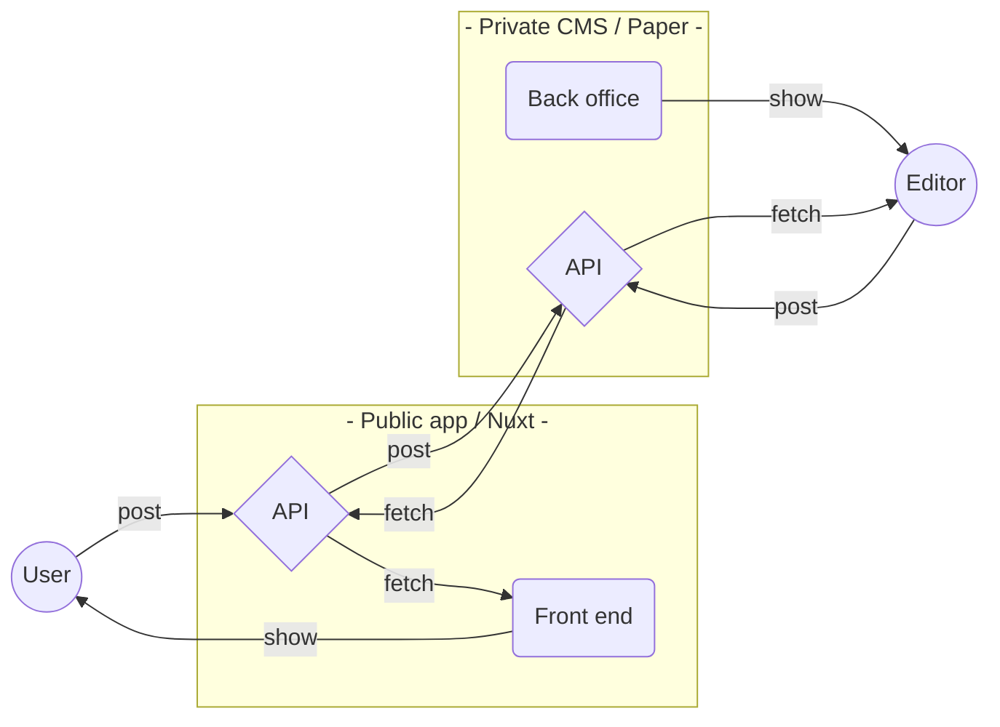

```powershell


   Oo    o.OOOo.    o      ooOoOOo o.     O       .oOOOo.
  o  O    O    `o  O          O    Oo     o       o     o        o
 O    o   o      O o          o    O O    O       O.
oOooOoOo  O      o o          O    O  o   o        `OOoo.
o      O  o      O O          o    O   o  O             `O .oOo  O  .oOo. 'OoOo. .oOo  .oOo.
O      o  O      o O          O    o    O O              o O     o  OooO'  o   O O     OooO'
o      O  o    .O' o     .    O    o     Oo       O.    .O o     O  O      O   o o     O
O.     O  OooOO'   OOoOooO ooOOoOo O     `o        `oooO'  `OoO' o' `OoO'  o   O `OoO' `OoO'


```

**Room Manager** — Proof of Concept

Made for showing of skills to  🧬  **ADLIN Science** team   👀

---

# Quick start with ⚙️ Make + 🐳 Docker Compose

## ✅  Pre-requisites

- **macOS** with Docker Desktop installed
- **Linux** with Docker engine installed
- **Windows**: **`make`** should work with WSL / MinGW / … (**untested**)

## 🏁  Start command

```shell
# 1. Bootstrap project
# (Working directory: repository root)
# -------------------------------------
make configure
make local


# 2. Access private back office
# Credentials: `admin` / `password`
# -------------------------------------
open http://localhost:7277


# 3. Access public front end
# -------------------------------------
open http://localhost:3055


# That's all folks, …enjoy!
```

## Developer onboarding

> **Note**  
> For TypeScript, linting tools, etc. to work properly, you **MUST** open a
> **workbench** with the **`./front`** directory as root.

👀  Interesting files to lurk :

- ./cms/paper-cms/models/api-v1.yaml
- ./front/api/index.ts
- ./front/plugin/cms.ts
- ./front/pages/rooms.vue
- ./front/docker/\*

# 🧪  Live demo

## Private CMS back office

> 💈  **[https://adlin-back.jc0.eu](https://adlin-back.jc0.eu)**

---

> **Note**  
> Credentials: `admin` / `password`.

## Public app front end

> 🛎  **[https://adlin-front.jc0.eu](https://adlin-front.jc0.eu)**

# ℹ️  Project insights

## Architecture



---

[Paper CMS](https://github.com/JulianCataldo/paper-cms) is used for Back office + API server.

Nuxt 2 is used for the front-end with:

- TypeScript
- Vuetify
- Toolings
- …

---

> **Warning**  
> This is a simple PoC, so no tests, no CI / CD, no deployments targets etc.  
> Still, as it's already dockerized, it's easy to adapt it for any environment.

---

© 2022 — [Julian Cataldo](https://www.juliancataldo.com)
